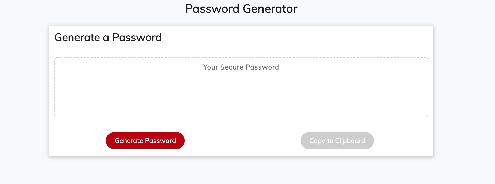

Week 03 - Unit 03 JavaScript Homework: Password Generator

Description

The files index.html is the webpage for the Password Generator 

Styling

Used Bootstrap 4 and CSS (style.css) for styling

Behavior

Used Javascript (script.js) to hold variables and functions responsible for generating the password on index.html

Website's elements adjust to the changes with the size of the browser. 

The website contains the following: 
- GIVEN that a user needs a new, secure password
- WHEN prompted for password criteria
- THEN a password is generated when the "Generate Password" button is pressed
- BONUS the generated password can be copied when the "Copy to Clipboard" button is pressed

Screenshot

Roadmap
- This is my final version in accordance to the homework requirement
- Improvements can be made regarding the input method of user's choice in the criteria for the password:
  - Using checkboxes instead of "confirm" in Javascript
  - Creating a box on the webpage for user to input password length to replace "prompt" in Javascript

Author

Gerald Lam

Project status

Project has been submitted through Bootcamp Spot as of Sunday 24th Nov 2019 and is considered to be a completed project. 
